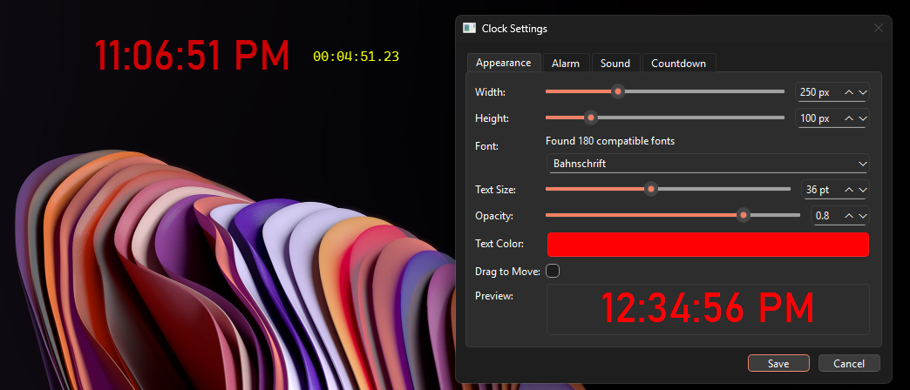

# ADHDClock


A customizable desktop clock with interval alerts designed specifically for those with ADHD or anyone who benefits from time awareness and regular reminders.
(I personally use this)
##### _Parts of this code were generated with AI assistance. While efforts have been made to ensure quality, please report any issues or unexpected behavior on the GitHub repository._



## Features

- **Always-visible transparent clock** that stays on top of other windows
- **Configurable interval alerts** to help maintain time awareness
- **Customizable appearance** including size, font, color, and opacity
- **Various alert sounds** with adjustable frequencies
- **Drag-to-move functionality** for easy repositioning
- **Right-click settings menu** for quick adjustments

## Why ADHDClock?

For individuals with ADHD, time blindness (difficulty perceiving the passage of time) can be a significant challenge. ADHDClock helps by:

- Providing a constant visual reminder of the current time
- Delivering auditory alerts at regular intervals to help maintain focus and task awareness
- Offering customization options to suit individual preferences and sensory needs
- Being unobtrusive while remaining effective

## Installation

### Prerequisites

- Python 3.7+
- pip package manager

### Dependencies

- numpy
- simpleaudio
- tkinter (usually included with Python)

### Setup

1. Clone the repository:

    ```
    git clone https://github.com/yourusername/ADHDClock.git
    cd ADHDClock
    ```
2. Create a virtual environment (recommended):

    `python -m venv venv`

3. Activate the virtual environment:
   - Windows: 
   
   `venv\Scripts\activate.bat`
     
   - macOS/Linux: 
   
   `source venv/bin/activate`

4. Install dependencies:

    `pip install numpy simpleaudio`

5. Run the application:

    `python main.py`

## Usage

1. **Launch the application** using the run_clock.bat script (Windows) or python main.py command
2. **Move the clock** by clicking and dragging anywhere on the time display
3. **Access settings** by right-clicking on the clock
4. **Configure alarms and appearance** through the settings dialog

### Settings

The settings dialog contains three tabs:

#### Appearance
- Width and height
- Font type and size
- Opacity level
- Text color
- Drag-to-move toggle

#### Alarm
- Enable/disable alarm
- Sound duration
- Interval between alarms (in seconds)

#### Sound
- Wave type selection (sine, square, sawtooth, triangle)
- Minimum and maximum frequencies
- Test sound button

## Configuration

All settings are stored in a ```config.json``` file that's automatically created on first run. You can manually edit this file or use the settings interface.

## Building from Source

The application is written in Python and doesn't require compilation. Simply follow the installation instructions above.

## Contributing

Contributions are welcome! Please feel free to submit a Pull Request.

1. Fork the repository
2. Create your feature branch (git checkout -b feature/amazing-feature)
3. Commit your changes (git commit -m 'Add some amazing feature')
4. Push to the branch (git push origin feature/amazing-feature)
5. Open a Pull Request

## License

This project is licensed under the MIT License - see the LICENSE file for details.
